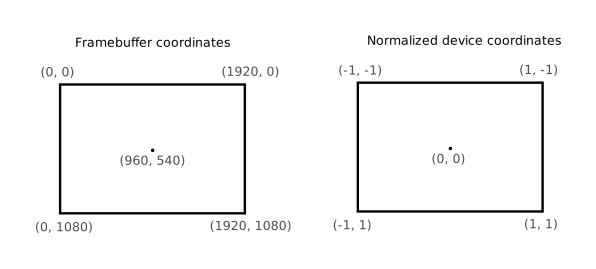

# Shader modules

与早期的 API 不同，Vulkan 中的着色器代码必须以字节码格式指定，而不是像 GLSL 和 HLSL 那样以人类可读的语法指定。 这种字节码格式称为 SPIR-V，设计用于 Vulkan 和 OpenCL（均为 Khronos API）。 这种格式可用于编写图形和计算着色器，但在本教程中，我们将重点讨论 Vulkan 图形管道中使用的着色器。

使用字节码格式的好处是，GPU 厂商编写的编译器将着色器代码转化为本地代码的复杂性大大降低。 过去的经验表明，对于像 GLSL 这样的人类可读语法，一些 GPU 供应商对标准的解释相当灵活。 如果你碰巧使用其中一家厂商的 GPU 编写了非繁琐的着色器，那么你将面临其他厂商的驱动程序因语法错误而拒绝你的代码的风险，或者更糟的是，你的着色器会因编译器错误而运行不正常。 有了像 SPIR-V 这样简单明了的字节码格式，就有望避免这种情况。

不过，这并不意味着我们需要手工编写字节码。 Khronos 发布了他们自己的独立于供应商的编译器，可将 GLSL 编译成 SPIR-V。 该编译器旨在验证你的着色器代码是否完全符合标准，并生成一个 SPIR-V 二进制文件，你可以将其与你的程序一起发布。 您也可以将此编译器作为一个库，在运行时生成 SPIR-V，但本教程中我们不会这样做。 虽然我们可以通过 glslangValidator.exe 直接使用该编译器，但我们将使用 Google 提供的 glslc.exe。 glslc 的优势在于它使用与 GCC 和 Clang 等知名编译器相同的参数格式，并包含一些额外的功能，如包含(*includes*)。 这两种编译器都已包含在 Vulkan SDK 中，因此您无需下载任何额外的东西。

GLSL 是一种具有 C 风格语法的着色语言。 用它编写的程序有一个主函数，每个对象都会调用该函数。 GLSL 使用全局变量来处理输入和输出，而不是使用参数作为输入和返回值作为输出。 该语言包含许多辅助图形编程的功能，如内置矢量和矩阵基元。 该语言还包括用于交叉乘积、矩阵-矢量乘积和矢量周围反射等操作的函数。 向量类型称为 $vecx$，x数字表示元素的数量。 例如，三维位置可以存储在 $vec3$ 中。 可以通过 .x 等成员访问单个分量，但也可以同时从多个分量创建一个新的矢量。 例如，表达式 $vec3(1.0, 2.0, 3.0).xy$ 的结果是 $vec2$。 向量的构造函数也可以使用向量对象和标量值的组合。 例如，$vec3$ 可以用 $vec3(vec2(1.0, 2.0), 3.0)$ 来构造。

正如前一章所述，我们需要编写一个顶点着色器和一个片段着色器来在屏幕上显示一个三角形。 接下来的两节将分别介绍这两个着色器的 GLSL 代码，之后我将向你展示如何制作两个 SPIR-V 二进制文件并将它们加载到程序中。

# Vertex shader

顶点着色器处理每个输入的顶点。 它将世界位置、颜色、法线和纹理坐标等属性作为输入。 输出是以片段坐标表示的最终位置，以及需要传递给片段着色器的属性，如颜色和纹理坐标。 光栅化器将对这些值进行片段插值，以生成平滑的渐变效果。

如果你以前接触过计算机图形学，你应该已经熟悉这些知识了。 如果您以前使用过 OpenGL，那么您会注意到 Y 坐标的符号现在翻转了。 Z 坐标现在使用的范围与 Direct3D 中相同，从 0 到 1。

对于第一个三角形，我们将不应用任何变换，而是直接指定三个顶点的位置，并将其归一化为设备坐标，从而创建以下形状

我们可以直接输出归一化设备坐标(device coordinates)，方法是从顶点着色器输出剪辑坐标(clip coordinates)，并将最后一个分量设为 1。

通常情况下，这些坐标会存储在顶点缓冲区中，但在 Vulkan 中创建顶点缓冲区并填充数据并非易事。 因此，我决定将这一工作推迟到我们看到三角形在屏幕上弹出之后再进行。 在此期间，我们要做一点非正统的事情：直接在顶点着色器中加入坐标。 代码如下
