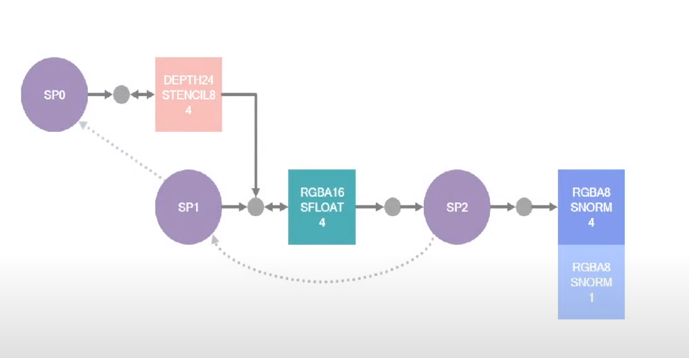
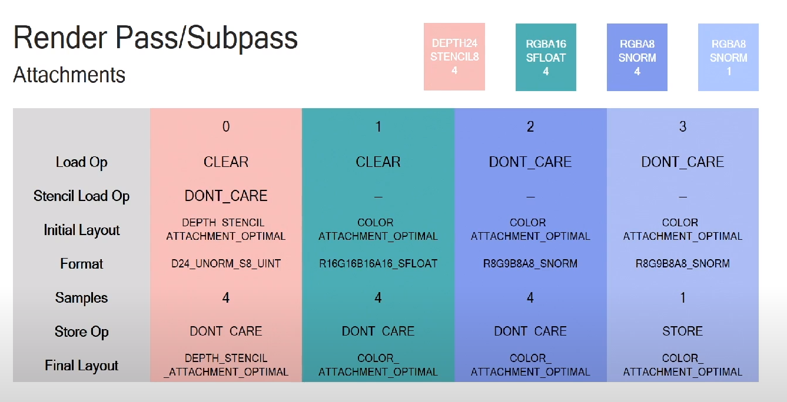
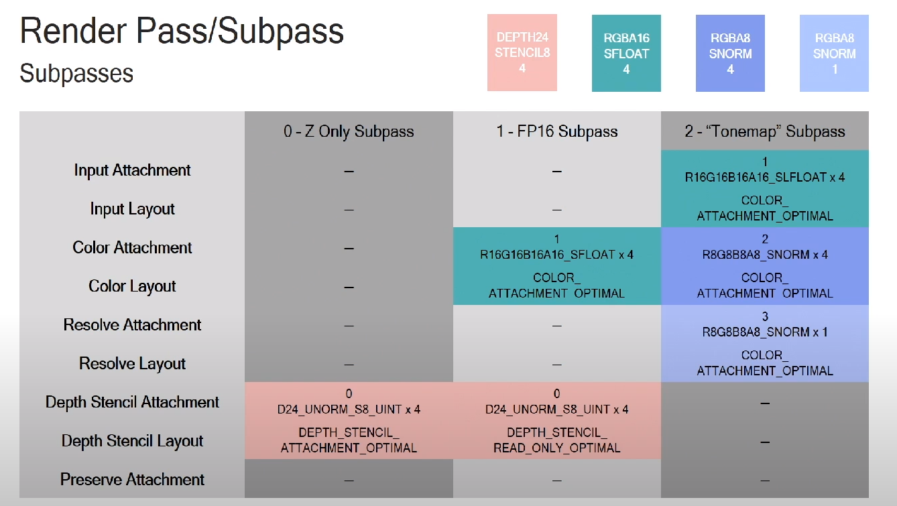
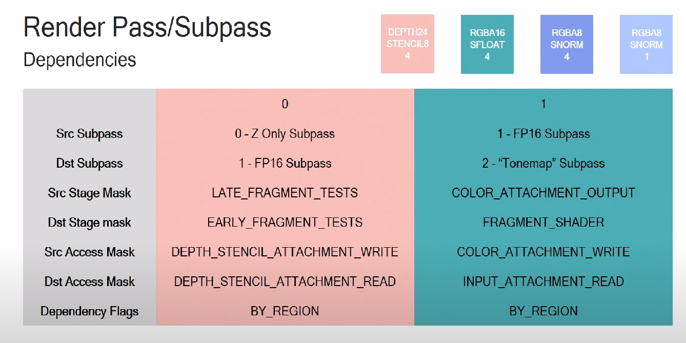

# setup

在进行管线创建之前，我们还需要设置用于渲染的帧缓冲附着。我们需要指定使用的颜色和深度缓冲，以及采样数，渲染操作如何处理缓冲的内容。所有这些信息被Vulkan包装为一个渲染流程对象，我们添加了一个叫做`createRenderPass`的函数来创建这一对象，然后在`initVulkan`函数中`createGraphicsPipeline`函数调用之前调用`createRenderPass`函数:

```c
void initVulkan()
{
    createInstance();
    setupDebugMessenger();
    createSurface();
    pickPhysicalDevice();
    createLogicalDevice();
    createSwapChain();
    createImageViews();
    createRenderPass();
    createGraphicPipeline();
}
```

# Attachment description

在这里，我们只使用了一个代表交换链图像的颜色缓冲附着。

```c
void createRenderPass() {
     VkAttachmentDescription colorAttachment{};
     colorAttachment.format = mSwapChainImageFormat;
     colorAttachment.samples = VK_SAMPLE_COUNT_1_BIT;
}
```

format成员变量用于指定颜色缓冲附着的格式。samples成员变量用于指定采样数，在这里，我们没有使用多重采样，所以将采样数设置为1。

loadOp和storeOp成员变量用于指定在渲染之前和渲染之后对附着中的数据(the data in the attachment) 进行的操作。对于loadOp成员变量，可以设置为下面这些值：

- `VK_ATTACHMENT_LOAD_OP_LOAD`: 保持附着(attachments)的现有内容

- `VK_ATTACHMENT_LOAD_OP_CLEAR`: 使用一个常量值来清除附着(attachments)的内容

- `VK_ATTACHMENT_LOAD_OP_DONT_CARE`:  不关心附着(attachments)现存的内容

在这里，我们设置loadOp成员变量的值为`VK_ATTACHMENT_LOAD_OP_CLEAR`，在每次渲染新的一帧前使用黑色清除帧缓冲。storeOp成员变量可以设置为下面这些值：

- `VK_ATTACHMENT_STORE_OP_STORE`: 渲染的内容会被存储起来，以便之后读取
- `VK_ATTACHMENT_STORE_OP_DONT_CARE`: 渲染后，不会读取帧缓冲的内容

我们希望在屏幕上看到渲染后的三角形，因此在这里我们采用存储操作。

`loadOp`和`storeOp`成员变量的设置会对颜色和深度缓冲起效。`stencilLoadOp`成员变量和`stencilStoreOp`成员变量会对模板缓冲起效。在这里，我们没有使用模板缓冲，所以设置对模板缓冲不关心即可。

```c
colorAttachment.stencilLoadOp = VK_ATTACHMENT_LOAD_OP_DONT_CARE;
colorAttachment.stencilStoreOp = VK_ATTACHMENT_STORE_OP_DONT_CARE;
```

Vulkan中的纹理(textures)和帧缓冲(framebuffer)由特定像素格式的`VkImage`对象来表示。图像的像素数据在内存中的分布取决于我们要对图像进行的操作。

下面是一些常用的图形内存布局设置：

- `VK_IMAGE_LAYOUT_COLOR_ATTACHMENT_OPTIMAL`: Image 被用作颜色附着(color attachment)
- `VK_IMAGE_LAYOUT_PRESENT_SRC_KHR`: swap chain 中定义的 image 设置
- `VK_IMAGE_LAYOUT_TRANSFER_DST_OPTIMAL`:定义为内存拷贝的目标格式

我们会在之后的章节对上述设置进行更为详细地说明。在这里，我们需要做的是指定适合我们在之后进行的渲染操作的图像布局即可。

`initialLayout`成员变量用于指定渲染流程开始前的图像布局方式。`finalLayout`成员变量用于指定渲染流程结束后的图像布局方式。将`initialLayout`成员变量设置为`VK_IMAGE_LAYOUT_UNDEFINED`表示我们不关心之前的图像布局方式。使用这一值后，图像的内容不保证会被保留，但对于我们的应用程序，每次渲染前都要清除图像，所以这样的设置更符合我们的需求。对于`finalLayout`成员变量，我们设置为`VK_IMAGE_LAYOUT_PRESENT_SRC_KHR` ，使得渲染后的图像可以被交换链呈现。

## Subpasses and attachment references

> 自流程和附着引用
> 
> subpasses are just a bunch of rendering task that are taking place in some order. Each subpasses has inputs and outputs and there are dependent between the subpasses.
> 
> 
> 
> SP0: writing to a depth buffer
> 
> SP1: has a depth buffer as a read-only depth buffer and writing in a color buffer
> 
> SP2: takes the color buffer and puts it in the final presentable form
> 
> The subpasses  in a render pass all render to the same dimensions, and fragments for pixel $(x, y, layer)$ in one subpass can only read attachment contents written by privous subpasses at the same $(x, y, layer)$ location.
> 
> Attachments example
> 
> 
> 
> subpasses example
> 
> 
> 
>  Denpencies
> 
> 
> 
> 


一个渲染流程可以包含多个子流程。子流程依赖于上一流程处理后的帧缓冲内容。比如，许多叠加的后期处理效果就是在上一次的处理结果上进行的。我们将多个子流程组成一个渲染流程后，Vulkan可以对其进行一定程度的优化。对于我们这个渲染三角形的程序，我们只使用了一个子流程。

每个子流程可以引用一个或多个附着，这些引用的附着是通过`VkAttachmentReference`结构体指定的：

`attachment`成员变量用于指定要引用的附着在附着描述结构体数组中的索引。在这里，我们的`VkAttachmentDescription`数组只包含了一个附着信息，所以将`attachment`指定为0即可。`layout`成员变量用于指定进行子流程时引用的附着使用的布局方式，Vulkan会在子流程开始时自动将引用的附着转换到`layout`成员变量指定的图像布局。我们推荐将`layout`成员变量设置为`VK_IMAGE_LAYOUT_COLOR_ATTACHMENT_OPTIMAL`，一般而言，它的性能表现最佳。

```c
VkAttachmentReference colorAttachmentRef{};
colorAttachmentRef.attachment = 0;
colorAttachmentRef.layout = VK_IMAGE_LAYOUT_COLOR_ATTACHMENT_OPTIMAL;
```

我们使用`VkSubpassDescription`结构体来描述子流程：

```c
VkSubpassDescription subpass{};
subpass.pipelineBindPoint = VK_PIPELINE_BIND_POINT_GRAPHICS;
subpass.colorAttachmentCount = 1;
subpass.pColorAttachments = &colorAttachmentRef;
```

 这里设置的颜色附着在数组中的索引会被片段着色器使用，对应我们在片段着色器中使用的 `layout(location = 0) out vec4 outColor`语句。
下面是其它一些可以被子流程引用的附着类型：

- `pInputAttachments`: Attachments that are read from a shader
- `pResolveAttachments`: Attachments used for multisampling color attachments
- `pDepthStencilAttachment`: Attachment for depth and stencil data
- `pPreserveAttachments`: Attachments that are not used by this subpass, but for which the data must be preserved


# Render pass

现在，我们已经设置好了附着和引用它的子流程，可以开车创建渲染流程对象。首先，我们在pipelineLayout变量定义之前添加一个VkRenderPass类型的成员变量。

```c
// render pass
VkRenderPass mRenderPass;
// Pipeline layout
VkPipelineLayout mPipelineLayout;
```


然后，可以通过在 `VkRenderPassCreateInfo` 结构中填入附件和子通道数组来创建呈现通道对象。 `VkAttachmentReference`对象会使用该数组的索引来引用附件。

```c
VkRenderPassCreateInfo renderPassInfo{};
renderPassInfo.sType = VK_STRUCTURE_TYPE_RENDER_PASS_CREATE_INFO;
renderPassInfo.attachmentCount = 1;
renderPassInfo.pAttachments = &colorAttachment;
renderPassInfo.subpassCount = 1;
renderPassInfo.pSubpasses = &subpass;

if (vkCreateRenderPass(mDevice, &renderPassInfo, nullptr, &mRenderPass) != VK_SUCCESS) {
     spdlog::error("{} failed to create render pass", __func__);
     throw std::runtime_error("failed to create render pass");
}
```
